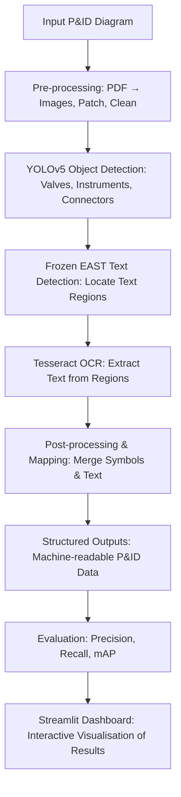

# P&ID Digitisation with Object Detection and OCR

## Overview  
This project explores the automation of **Piping & Instrumentation Diagram (P&ID)** digitisation by combining:  
- **Object detection (YOLOv5)** for engineering symbols  
- **Text detection (Frozen EAST)** for locating text regions  
- **Optical character recognition (Tesseract OCR)** for extracting labels  

The aim was to demonstrate that complex engineering diagrams can be converted into structured, machine-readable formats, enabling:  
- Faster search and retrieval of engineering information  
- Significant reduction in manual effort required to interpret diagrams  
- A foundation for integrating P&IDs into analytics and predictive maintenance workflows  

The trained YOLOv5 model achieves **high precision and recall for frequently occurring components** such as Ball Valves, Field Instruments, and Platform Control Systems, demonstrating the feasibility of automated P&ID digitisation. Rare components such as certain regulators remain challenging due to limited training examples.  

This work was completed as part of my role at **CNOOC International** and served as a **proof-of-concept** for digitising several hundred diagrams across multiple assets.  

---

## Folder Structure
    
    src/
    ├── detection/
    │ ├── east_text_detector.py
    │ ├── models/
    │ │ └── frozen_east_text_detection.pb
    │ ├── object_detector_train.py
    │ ├── text_detection_model.py
    │ └── yolo_object_detection.py
    ├── main_app/
    │ └── streamlit_app.py
    ├── postprocessing/
    │ ├── image_deconstruction.py
    │ ├── image_reconstruction.py
    │ └── text_extraction.py
    └── preprocessing/
    ├── Create_Test_Train_Validation_Splits.py
    ├── images_to_patches.py
    └── pdf_to_image_converter.py
    Dataset/
    └── ... full dataset of P&IDs ...
    Demo/
    └── ... small subset of P&IDs for quick testing ...
    yolov5/
    └── ... Ultralytics YOLOv5 cloned GitHub repo ...

---

## Data Preparation & Pre-processing

The P&IDs in the dataset are scanned documents, some up to 30 years old, stored as PDFs. Due to variability in size and scan quality, the following steps were applied:

- **PDF to Image Conversion**  
  PDFs were converted to JPG images for compatibility with deep learning pipelines.

- **Border Removal**  
  Borders were manually removed to simplify object detection. Line detection was considered out of scope.

- **Dataset Split**  
  Images were split into Training (70%), Validation (15%), and Test (15%) sets.

- **Image Patching**  
  Large diagrams were divided into 448x448 pixel patches to enable efficient training.  
  - Training set: 69 images → 1,895 patches → 8,200 objects annotated  
  - Validation set: 22 images → 525 patches → 1,700 objects annotated  

- **Annotation**  
  - **Symbols:** 19 classes annotated using CVAT. Some classes, such as Ball Valves, Field Instruments, and Flanges, dominate the dataset.  
  - **Text:** 35,000 text instances were manually annotated across training and validation sets for evaluation, though automated detection was performed using Frozen EAST.  

**Note: Class imbalance exists due to natural distribution; synthetic balancing was out of scope.**

---

## Pipeline Overview  


---

## Steps:

1. Pre-processing – Convert PDFs, clean images, create patches

2. YOLOv5 Detection – Recognises valves, instruments, connectors, and other symbols

3. Frozen EAST – Detects text regions within diagrams

4. OCR (Tesseract) – Extracts text from detected regions

5. Post-processing – Merges OCR results with detected symbols to build structured outputs

6. Evaluation – Precision, recall, and mean average precision (mAP) across 19 classes

7. Streamlit Visualisation – Interactive dashboard to explore detection outputs and model performance

---

## Model Training (Optional)

- YOLOv5 can be retrained on your dataset using object_detector_train.ipynb in src/detection/.

- Pre-trained weights are stored under yolov5/runs/train/ and loaded automatically by the Streamlit app.

- The EAST text detector (frozen_east_text_detection.pb) is loaded automatically by the Streamlit app.

---

## Model Performance

The YOLOv5 detector was trained on a labelled dataset of 1,694 objects across 19 P&ID component classes. Evaluation metrics are summarised below:

| Class                            | Instances | Precision | Recall | mAP@0.5 | mAP@0.5:0.95 |
| -------------------------------- | --------- | --------- | ------ | ------- | ------------ |
| Generic Valve                    | 99        | 0.924     | 0.869  | 0.900   | 0.709        |
| Needle Valve                     | 86        | 0.909     | 1.000  | 0.993   | 0.836        |
| Ball Valve                       | 405       | 0.934     | 0.990  | 0.989   | 0.855        |
| Globe Valve                      | 17        | 0.575     | 1.000  | 0.940   | 0.782        |
| Field Instruments                | 202       | 0.876     | 0.976  | 0.980   | 0.935        |
| Platform Control System          | 113       | 0.926     | 0.982  | 0.992   | 0.948        |
| Control Systems                  | 1         | 1.000     | 0.000  | 0.003   | 0.002        |
| Local Panel Gauge Board          | 19        | 0.893     | 1.000  | 0.995   | 0.959        |
| Reducer                          | 130       | 0.914     | 0.981  | 0.986   | 0.774        |
| Flange                           | 473       | 0.842     | 0.787  | 0.863   | 0.479        |
| Butterfly Valve                  | 65        | 0.931     | 0.862  | 0.873   | 0.663        |
| Pressure Reducing Regulator      | 2         | 0.588     | 1.000  | 0.995   | 0.846        |
| Back Pressure Reducing Regulator | 1         | 0.333     | 1.000  | 0.332   | 0.332        |
| Pressure Control Valve           | 10        | 0.710     | 1.000  | 0.968   | 0.813        |
| Connector                        | 71        | 0.872     | 0.915  | 0.942   | 0.752        |
| **All (avg)**                    | 1694      | 0.815     | 0.891  | 0.850   | 0.712        |


Highlights:

Strong performance on common components:

- Ball Valve (mAP@0.5: 0.989, Recall: 0.990)

- Field Instruments (mAP@0.5: 0.980, Recall: 0.976)

- Platform Control System (mAP@0.5: 0.992, Recall: 0.982)

Improved consistency across valves:

- Generic Valve, Needle Valve, Butterfly Valve all achieve >0.87 mAP@0.5

Lower performance on rare components:

- Regulators and Control Systems have very low support (1–2 instances) → future work should focus on balancing these classes

Overall:

- The model achieves 0.85 mAP@0.5 and 0.712 mAP@0.5:0.95 across 19 classes

- Confirms that automated P&ID digitisation with CV methods is feasible and scalable given sufficient labelled data

--- 

## Limitations & Future Work

This project was conducted as a research proof-of-concept. The following points outline areas for further development:

- Data imbalance: Rare components under-represented → additional labelled examples needed

- OCR accuracy: Sensitive to font size/quality → could improve with better preprocessing or transformer-based OCR

- Symbol-text mapping: Future extension to link text labels directly to symbols

- Deployment: Containerisation (Docker) or API layer (FastAPI/Streamlit) for production-ready usage

- MLOps extensions: MLflow for experiment tracking, CI/CD pipelines, scalable data processing

---

## Reproducibility

Due to confidentiality of the underlying P&IDs, no sample diagrams or outputs are included in this repository. However, the following are provided to ensure reproducibility:

- Preprocessing scripts included in src/preprocessing/

- Trained YOLOv5 weights stored in yolov5/runs/train/

- EAST model included under src/detection/models/

---

## Installation

Clone the repo and set up the environment:

```Python
git clone https://github.com/S-Houston/digitised-pid-mlops.git
cd digitised-pid-mlops

# Create environment
conda create -n pid python=3.9
conda activate pid

# Install dependencies
pip install -r requirements.txt
```
---

## Usage

Activate environment and navigate to src/main_app

Launch Streamlit dashboard

```Python
conda activate pid
streamlit run streamlit_app.py
```
Note:
 - The Streamlit application is currently configured to run on the Demo subset of the dataset only. To run on the full dataset, the folder structure and app code would need adjustments to handle the Training, Validation, and Test subfolders.
---

## Why This Matters

P&IDs are central to process safety and asset management in oil & gas. By digitising them:

- Engineers can access information faster and with fewer manual errors

- Diagrams can be integrated into predictive maintenance workflows, linking tags with sensor data

- Legacy documentation can be made machine-readable, unlocking value in decades of historical records

This project demonstrates end-to-end applied data science: computer vision, OCR, data engineering, evaluation, and delivery via an interactive app balancing research rigour with practical pathways to production.


