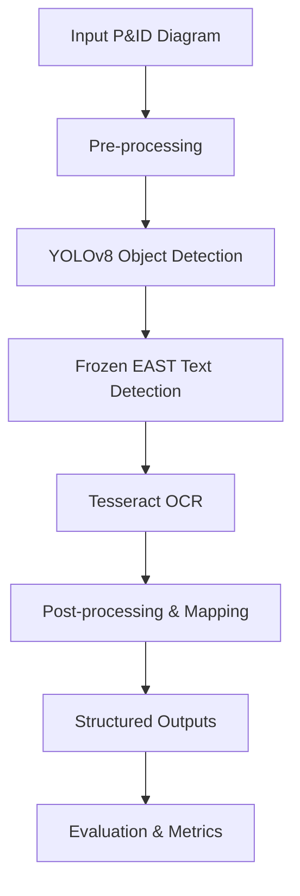

## Overview  
This project explores the automation of **Piping & Instrumentation Diagram (P&ID)** digitisation by combining:  
- **Object detection (YOLOv8)** for engineering symbols  
- **Text detection (Frozen EAST)** for locating text regions  
- **Optical character recognition (Tesseract OCR)** for extracting labels  

The aim was to demonstrate that complex engineering diagrams can be converted into structured, machine-readable formats, enabling:  
- Faster search and retrieval of engineering information  
- Reduction in manual effort required to interpret diagrams  
- A foundation for integrating P&IDs into analytics and predictive maintenance workflows  

This work was completed as part of my role at **CNOOC International** and served as a **proof-of-concept** for digitising several hundred diagrams across multiple assets.  

---

## Data Preparation & Pre-processing

The P&IDs in the dataset are scanned documents, some up to 30 years old, stored as PDFs. Due to variability in size and scan quality, the following steps were applied:

PDF to Image Conversion
PDFs were converted to JPG images for compatibility with deep learning pipelines.

Border Removal
Borders were manually removed to simplify object detection. Line detection was considered out of scope.

Dataset Split
Images were split into Training (70%), Validation (15%), and Test (15%) sets.

Image Patching
Large diagrams were divided into 448x448 pixel patches to enable efficient training.

Training set: 69 images → 1,895 patches → 8,200 objects annotated

Validation set: 22 images → 525 patches → 1,700 objects annotated

Annotation

Symbols: 19 classes annotated using CVAT
. Some classes, such as Ball Valves, Field Instruments, and Flanges, dominate the dataset.

Text: 35,000 text instances were manually annotated across training and validation sets for evaluation, though automated detection was performed using Frozen EAST.

Note: Class imbalance exists due to natural distribution; synthetic balancing was out of scope.

---

## Pipeline Overview  


---

## Steps:

Pre-processing – Image cleaning (binarisation, resizing) to improve clarity

YOLOv8 Detection – Recognises valves, instruments, connectors, and other symbols

Frozen EAST – Detects text regions within diagrams

OCR (Tesseract) – Extracts text from detected regions

Post-processing – Merges OCR results with detected symbols to build structured outputs

Evaluation – Precision, recall, and mean average precision (mAP) across 13 classes

Streamlit Visualisation – Interactive dashboard to explore detection outputs and model performance

---

## Model Performance

The YOLOv8 detector was trained on a labelled dataset of 1,694 objects across 13 P&ID component classes. Evaluation metrics are summarised below:

| Class                            | Instances | Precision | Recall    | mAP@0.5   | mAP@0.5:0.95 |
| -------------------------------- | --------- | --------- | --------- | --------- | ------------ |
| Generic Valve                    | 99        | 0.982     | 0.818     | 0.889     | 0.679        |
| Needle Valve                     | 86        | 0.926     | 1.000     | 0.994     | 0.852        |
| Ball Valve                       | 405       | 0.952     | 0.975     | 0.987     | 0.857        |
| Globe Valve                      | 17        | 0.510     | 0.941     | 0.921     | 0.753        |
| Field Instruments                | 202       | 0.914     | 0.941     | 0.980     | 0.945        |
| Platform Control System          | 113       | 0.965     | 0.970     | 0.988     | 0.936        |
| Control Systems                  | 1         | 1.000     | 0.000     | 0.007     | 0.007        |
| Local Panel Gauge Board          | 19        | 0.957     | 1.000     | 0.995     | 0.938        |
| Reducer                          | 130       | 0.928     | 0.969     | 0.986     | 0.786        |
| Flange                           | 473       | 0.907     | 0.759     | 0.864     | 0.460        |
| Butterfly Valve                  | 65        | 0.929     | 0.877     | 0.878     | 0.673        |
| Pressure Reducing Regulator      | 2         | 0.577     | 1.000     | 0.663     | 0.531        |
| Back Pressure Reducing Regulator | 1         | 0.322     | 1.000     | 0.497     | 0.448        |
| Pressure Control Valve           | 10        | 0.827     | 0.900     | 0.887     | 0.708        |
| Connector                        | 71        | 0.909     | 0.705     | 0.885     | 0.758        |
| **All (avg)**                    | **1694**  | **0.84**  | **0.857** | **0.828** | **0.688**    |


Highlights:

Strong results for common components such as Ball Valves and Field Instruments

Lower performance for rare classes (e.g. regulators with <3 instances) → future work requires balanced training data

Overall metrics show that P&ID digitisation with CV methods is feasible and scalable given sufficient labelled data

--- 

## Limitations & Future Work

This project was conducted as a research proof-of-concept. The following points outline areas for further development:

Data imbalance: Rare components under-represented → additional labelled examples needed

OCR accuracy: Sensitive to font size/quality → could improve with better preprocessing or transformer-based OCR

Symbol-text mapping: Future extension to link text labels directly to symbols

Deployment: Containerisation (Docker) or API layer (FastAPI/Streamlit) for production-ready usage

MLOps extensions: MLflow for experiment tracking, CI/CD pipelines, scalable data processing

---

## Reproducibility

Due to confidentiality of the underlying P&IDs, no sample diagrams or outputs are included in this repository. However, the following are provided to ensure reproducibility:

Config files (configs/) to set model weights and thresholds

Pipeline runner (pipeline.py) for end-to-end execution

Utility modules (utils/) for visualisation and post-processing

Streamlit app (streamlit_app.py) to interactively explore results

Requirements file for environment setup

---

## Installation

Clone the repo and set up the environment:

```Python
git clone https://github.com/S-Houston/digitised-pid-mlops.git
cd digitised-pid-mlops

# Create environment
conda create -n pid python=3.9
conda activate pid

# Install dependencies
pip install -r requirements.txt
```
---

## Usage

Run the pipeline on an input directory of diagrams (replace paths as needed):

```Python
python pipeline.py --config configs/default.yaml --input data/ --output outputs/
```

Launch Streamlit dashboard

```Python
streamlit run streamlit_app.py
```

---

## Why This Matters

P&IDs are central to process safety and asset management in oil & gas. By digitising them:

Engineers can access information faster and with fewer manual errors

Diagrams can be integrated into predictive maintenance workflows, linking tags with sensor data

Legacy documentation can be made machine-readable, unlocking value in decades of historical records

This project demonstrates end-to-end applied data science: computer vision, OCR, data engineering, evaluation, and delivery via an interactive app balancing research rigour with practical pathways to production.


